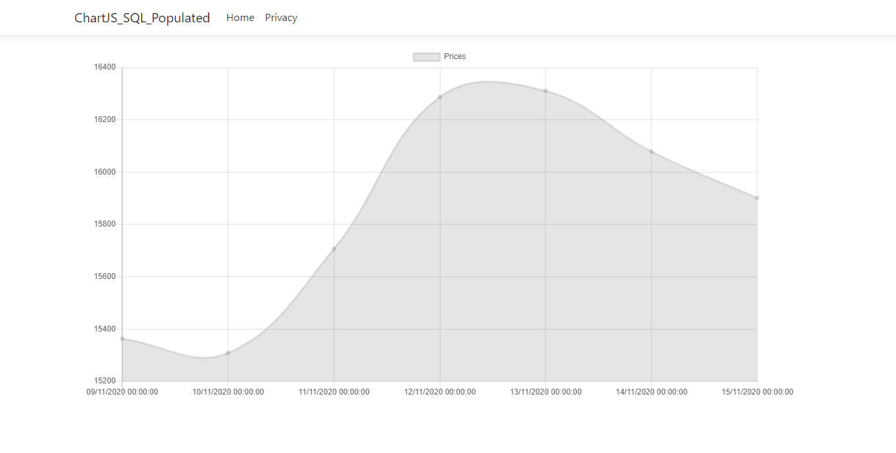

# Bitcoin-Chart---ChartJS-SQL-Populated
Simple .Net Core app that tracks BTC price with nomics.com API. Results are saved to a SQL db and retrived via an SQL query to be plotted onto a Js chart

This app is still under development, but has core functionality. 

Currently, the chart will display the last 7 days of data. This will be modifed so the user can set the historic timescale. Additionally, the GetBtcPrices function needs to be modified via JavaScirpt to retrieve daily results.

Watch this space :) 
