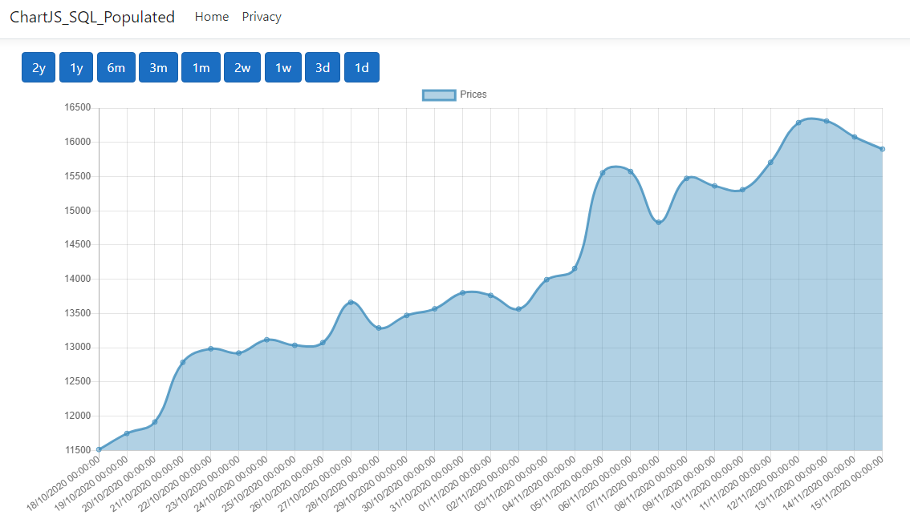

# Bitcoin-Chart---ChartJS-SQL-Populated
Simple .Net Core app that tracks BTC price with nomics.com API. Results are saved to a SQL db and retrived via an SQL query to be plotted onto a Js chart

This app is still under development, but has core functionality. When this small project is complete I will implement it into a angular project to make the front end pretty.

GetBtcPrices function needs to be modified via JavaScirpt to retrieve daily results.

Watch this space :) 
